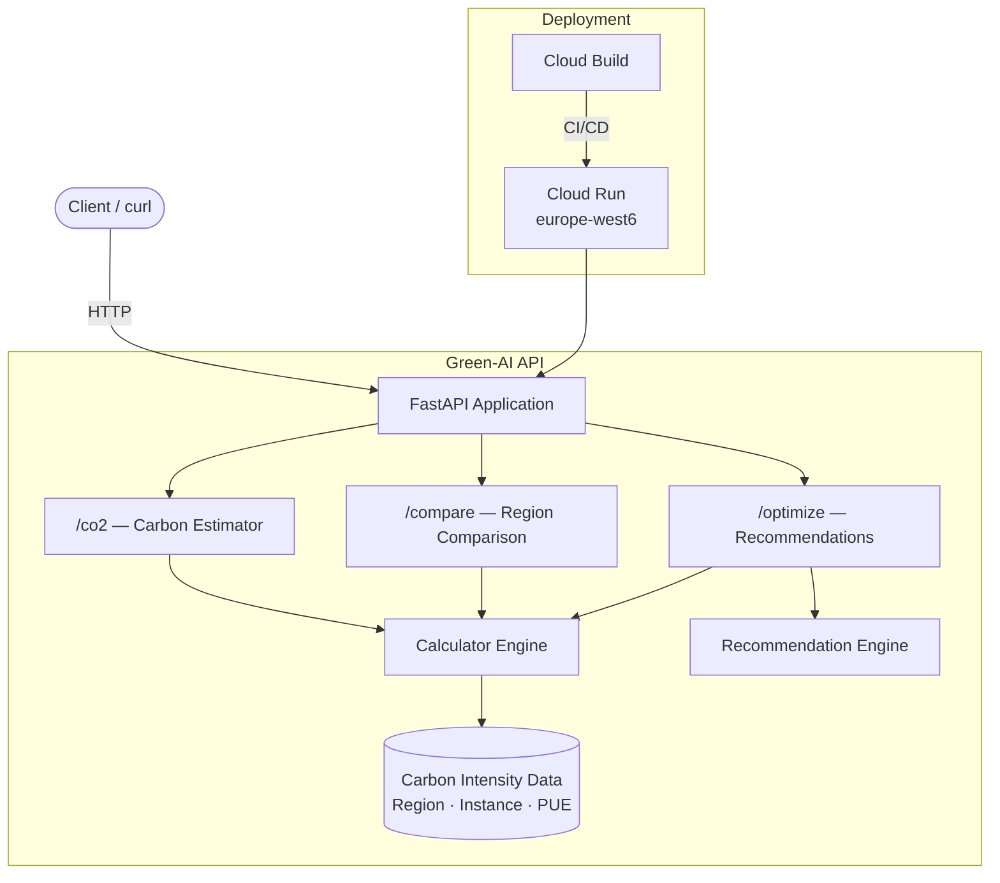

# Green-AI API

**Estimate, compare, and optimize the carbon footprint of your cloud AI workloads.**

Cloud computing accounts for ~1% of global electricity consumption. The carbon intensity varies dramatically between regions — from 15 gCO2eq/kWh (Quebec) to 500+ gCO2eq/kWh (parts of Asia). This API helps teams make data-driven decisions about *where* and *how* to run workloads to minimize their environmental impact.

## Architecture



## Features

- **CO2 Calculator** — Estimate emissions based on region, instance type, utilization, and runtime
- **Cloud Comparison** — Quantify savings from migrating to greener regions (e.g., `aws-us-east-1` → `gcp-europe-west6`)
- **Optimization Engine** — Actionable recommendations: region migration, right-sizing, serverless, spot instances, batch scheduling

## Quick Start

### Prerequisites
- Python 3.11+
- Docker (optional)

### Local Setup

```bash
python -m venv .venv
source .venv/bin/activate   # Windows: .venv\Scripts\activate
pip install -r requirements.txt

uvicorn app.main:app --reload
```

### Docker

```bash
docker compose up --build
```

The API is available at `http://localhost:8000`. Interactive docs at `http://localhost:8000/docs`.

## Example Requests

### Estimate CO2

```bash
curl -X POST http://localhost:8000/co2 \
  -H "Content-Type: application/json" \
  -d '{
    "region": "aws-us-east-1",
    "instance_type": "m5.xlarge",
    "utilization": 0.6,
    "hours": 720
  }'
```

```json
{
  "region": "aws-us-east-1",
  "instance_type": "m5.xlarge",
  "utilization": 0.6,
  "hours": 720.0,
  "energy_kwh": 55.987,
  "carbon_g": 21220.08,
  "carbon_kg": 21.2201
}
```

### Compare Regions

```bash
curl -X POST http://localhost:8000/compare \
  -H "Content-Type: application/json" \
  -d '{
    "source_region": "aws-us-east-1",
    "target_region": "gcp-europe-west6",
    "instance_type": "m5.xlarge",
    "utilization": 0.5
  }'
```

```json
{
  "source_region": "aws-us-east-1",
  "target_region": "gcp-europe-west6",
  "source_carbon_kg": 18.7034,
  "target_carbon_kg": 1.1344,
  "savings_kg": 17.569,
  "savings_percent": 93.94
}
```

### Get Optimization Recommendations

```bash
curl -X POST http://localhost:8000/optimize \
  -H "Content-Type: application/json" \
  -d '{
    "region": "aws-us-east-1",
    "instance_type": "m5.xlarge",
    "utilization": 0.2,
    "workload_type": "web-serving"
  }'
```

## Development

### Run Tests

```bash
python -m pytest tests/ -v
```

### Lint

```bash
python -m ruff check app/ tests/
```

### Project Structure

```
green-ai-api/
├── app/
│   ├── main.py            # FastAPI application & endpoints
│   ├── models.py           # Pydantic request/response models
│   ├── calculator.py       # CO2 calculation engine
│   ├── carbon_data.py      # Region/instance carbon intensity data
│   └── logging_config.py   # Structured logging setup
├── tests/
│   ├── test_calculator.py  # Unit tests for calculation logic
│   └── test_api.py         # Integration tests for API endpoints
├── docs/
│   └── api-reference.md    # API documentation
├── Dockerfile              # Multi-stage production build
├── docker-compose.yml      # Local development
├── cloudbuild.yaml         # GCP Cloud Build CI/CD
├── requirements.txt        # Pinned dependencies
└── pyproject.toml          # Ruff & pytest configuration
```

## Carbon Data Sources

- Regional grid intensity: [Electricity Maps](https://app.electricitymaps.com)
- PUE values: provider sustainability reports (Google: 1.1, AWS: 1.2, Azure: 1.18)
- Instance TDP: published spec sheets and benchmarks

## License

MIT
